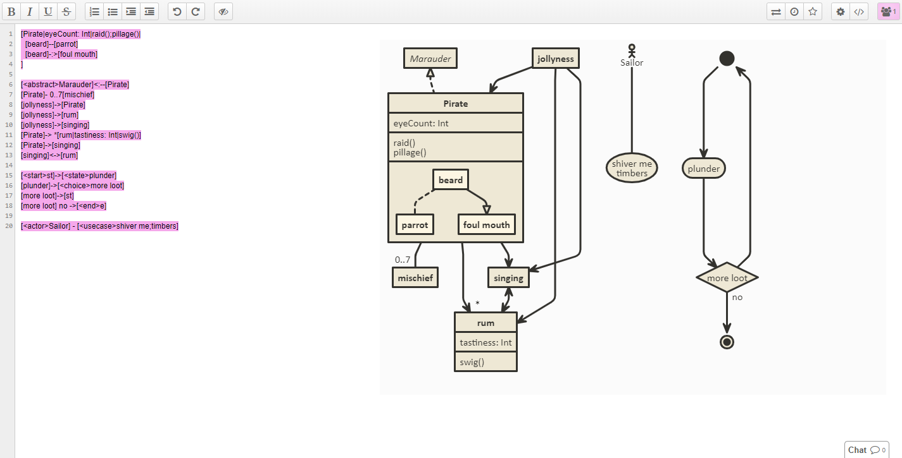

# [nomnoml](http://www.nomnoml.com/) plugin for [etherpad-lite](https://github.com/ether/etherpad-lite)



# Installation
```
git clone --branch master https://github.com/ether/etherpad-lite.git
cd etherpad-lite
mkdir -p plugins-available
git clone --branch master https://github.com/niicoooo/ep_nomnoml.git plugins-available/ep_nomnoml
npm install plugins-available/ep_nomnoml
./bin/run.sh
```

# Enjoy!

try typing:
```
[nomnoml] is -> [awesome]
```
or
```
[Pirate|eyeCount: Int|raid();pillage()|
  [beard]--[parrot]
  [beard]-:>[foul mouth]
]

[<abstract>Marauder]<:--[Pirate]
[Pirate]- 0..7[mischief]
[jollyness]->[Pirate]
[jollyness]->[rum]
[jollyness]->[singing]
[Pirate]-> *[rum|tastiness: Int|swig()]
[Pirate]->[singing]
[singing]<->[rum]

[<start>st]->[<state>plunder]
[plunder]->[<choice>more loot]
[more loot]->[st]
[more loot] no ->[<end>e]

[<actor>Sailor] - [<usecase>shiver me;timbers]
```
